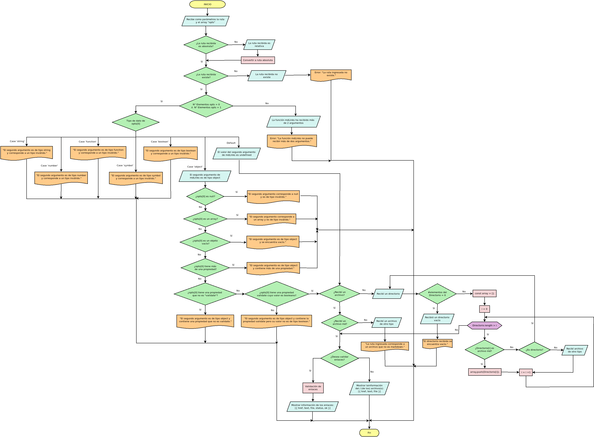

<p align="center"><a href="src/assets/marked-link.png"></a></p>
<h1 align="center">Marked Links</h1>
<p align="center">


</p>

## Preámbulo

[Markdown](https://es.wikipedia.org/wiki/Markdown) es un lenguaje de marcado
ligero. Es usado en muchísimas plataformas que manejan texto plano (GitHub, 
foros, blogs, ...), y es muy común encontrar varios archivos en ese formato 
en cualquier tipo de repositorio (empezando por el tradicional `README.md`).

## El problema:

Estos archivos `Markdown` normalmente contienen _links_ (vínculos/ligas) que
muchas veces están rotos o ya no son válidos y eso perjudica mucho el valor de
la información que se quiere compartir.

## La solución:

`Marked-Links` es una librería que lee y analiza archivos en formato `Markdown`,
para verificar los links que contengan y reportar algunas estadísticas.


## Consideraciones generales

- `Marked-Links` se ejecuta con `Node.js` lo que nos permite ejecutar JavaScript en el 
entorno del sistema operativo ya sea en tu máquina o un servidor, y así poder 
interactuar con el sistema de archivos, entorno, redes, etc.

- El _parseado_ (análisis) del markdown para extraer los links se realiza mediante una 
combinación de _módulos_; primero, transformamos el markdown a HTML usando
[marked](https://github.com/markedjs/marked) y de ahí extraemos los links con una librería 
de DOM, en este caso [JSDOM](https://github.com/jsdom/jsdom).

- La librería incluye un _ejecutable_ que podemos invocar en la línea de comando como 
una interfaz que podemos importar con `require` para usarlo programáticamente.

- El módulo es instalable desde el registro público de NPM y también, directamente desde
Github (ya que el respositorio es público y contiene un `package.json` válido).


## Algoritmo empleado:
<a href="src/utils/df.png"></a>

## Criterios de aceptacion

Estos son los criterios de lo que debe ocurrir para que se satisfagan 
las necesidades del usuario:

- Instalar la libreria via `npm install --global <github-user>/md-links`

### `README.md`

- Encontrar el *pseudo codigo* o *diagrama de flujo* con el algoritmo que
  soluciona el problema.
- Encontrar un board con el backlog para la implementación de la librería.
- Encontrar la documentación técnica de la librería.
- Encontrar la Guía de uso e instalación de la librería.

### API `mdLinks(path, opts)`

- El módulo exporta una función con la interfaz (API) esperada.
- El módulo implementa soporte para archivo individual
- El módulo implementa soporte para directorios
- El módulo implementa `options.validate`

### CLI

- Expone ejecutable `md-links` en el path (configurado en `package.json`)
- Se ejecuta sin errores / output esperado.
- El ejecutable implementa `--validate`.
- El ejecutable implementa `--stats`.
- El ejecutable implementa `--validate` y `--stats` juntos.


### JavaScript API

El módulo debe poder importarse en otros scripts de Node.js y debe ofrecer la
siguiente interfaz:

#### `mdLinks(path, options)`

##### Argumentos

- `path`: Ruta absoluta o relativa al archivo o directorio. Si la ruta pasada es
  relativa, debe resolverse como relativa al directorio desde donde se invoca
  node - _current working directory_).
- `options`: Un objeto con las siguientes propiedades:
  * `validate`: Booleano que determina si se desea validar los links
    encontrados.

##### Valor de retorno

La función debe retornar una promesa (`Promise`) que resuelva a un arreglo
(`Array`) de objetos (`Object`), donde cada objeto representa un link y contiene
las siguientes propiedades:

- `href`: URL encontrada.
- `text`: Texto que aparecía dentro del link (`<a>`).
- `file`: Ruta del archivo donde se encontró el link.

#### Ejemplo

```js
const mdLinks = require("md-links");

mdLinks("./some/example.md")
  .then(links => {
    // => [{ href, text, file }]
  })
  .catch(console.error);

mdLinks("./some/example.md", { validate: true })
  .then(links => {
    // => [{ href, text, file, status, ok }]
  })
  .catch(console.error);

mdLinks("./some/dir")
  .then(links => {
    // => [{ href, text, file }]
  })
  .catch(console.error);
```

### CLI (Command Line Interface - Interfaz de Línea de Comando)

El ejecutable de nuestra aplicación debe poder ejecutarse de la siguiente
manera a través de la terminal:

`md-links <path-to-file> [options]`

Por ejemplo:

```sh
$ md-links ./some/example.md
./some/example.md http://algo.com/2/3/ Link a algo
./some/example.md https://otra-cosa.net/algun-doc.html algún doc
./some/example.md http://google.com/ Google
```

El comportamiento por defecto no debe validar si las URLs responden ok o no,
solo debe identificar el archivo markdown (a partir de la ruta que recibe como
argumento), analizar el archivo Markdown e imprimir los links que vaya
encontrando, junto con la ruta del archivo donde aparece y el texto
que hay dentro del link (truncado a 50 caracteres).

#### Options

##### `--validate`

Si pasamos la opción `--validate`, el módulo debe hacer una petición HTTP para
averiguar si el link funciona o no. Si el link resulta en una redirección a una
URL que responde ok, entonces consideraremos el link como ok.

Por ejemplo:

```sh13d99df067c1
$ md-13d99df067c1
./some/example.md http://algo.com/2/3/ ok 200 Link a algo
./some/example.md https://otra-cosa.net/algun-doc.html fail 404 algún doc
./some/example.md http://google.com/ ok 301 Google
```

Vemos que el _output_ en este caso incluye la palabra `ok` o `fail` después de
la URL, así como el status de la respuesta recibida a la petición HTTP a dicha
URL.

##### `--stats`

Si pasamos la opción `--stats` el output (salida) será un texto con estadísticas
básicas sobre los links.

```sh
$ md-links ./some/example.md --stats
Total: 3
Unique: 3
```

También podemos combinar `--stats` y `--validate` para obtener estadísticas que
necesiten de los resultados de la validación.

```sh
$ md-links ./some/example.md --stats --validate
Total: 3
Unique: 3
Broken: 1
```

## Sobre la librería:

- Implementada en `JavaScript`.
- Se ejecuta utilizando `Node.js`. 
- Dependencias: `marked`, `node-fetch`, `jsdom` y `colors`.
- Linter: `Eslint`.
- Otras tecnologías: `Jest`.
- Las pruebas unitarias cubren el 100% de `coverage`.


## Recursos

- [What exactly is Node.js? - freeCodeCamp](https://medium.freecodecamp.org/what-exactly-is-node-js-ae36e97449f5)
- [¿Qué es Node.js y para qué sirve? - drauta.com](https://www.drauta.com/que-es-nodejs-y-para-que-sirve)
- [¿Qué es Nodejs? Javascript en el Servidor - Fazt en YouTube](https://www.youtube.com/watch?v=WgSc1nv_4Gw)
- [¿Simplemente qué es Node.js? - IBM Developer Works, 2011](https://www.ibm.com/developerworks/ssa/opensource/library/os-nodejs/index.html)
- [Node.js y npm](https://www.genbeta.com/desarrollo/node-js-y-npm)
- [Módulos, librerías, paquetes, frameworks... ¿cuál es la diferencia?](http://community.laboratoria.la/t/modulos-librerias-paquetes-frameworks-cual-es-la-diferencia/175)
- [Asíncronía en js](https://carlosazaustre.com/manejando-la-asincronia-en-javascript/)
- [NPM](https://docs.npmjs.com/getting-started/what-is-npm)
- [Publicar packpage](https://docs.npmjs.com/getting-started/publishing-npm-packages)
- [Crear módulos en Node.js](https://docs.npmjs.com/getting-started/publishing-npm-packages)
- [Linea de comando CLI](https://medium.com/netscape/a-guide-to-create-a-nodejs-command-line-package-c2166ad0452e)
- [Promise](https://javascript.info/promise-basics)
- [Comprendiendo Promesas en Js](https://hackernoon.com/understanding-promises-in-javascript-13d99df067c1)

